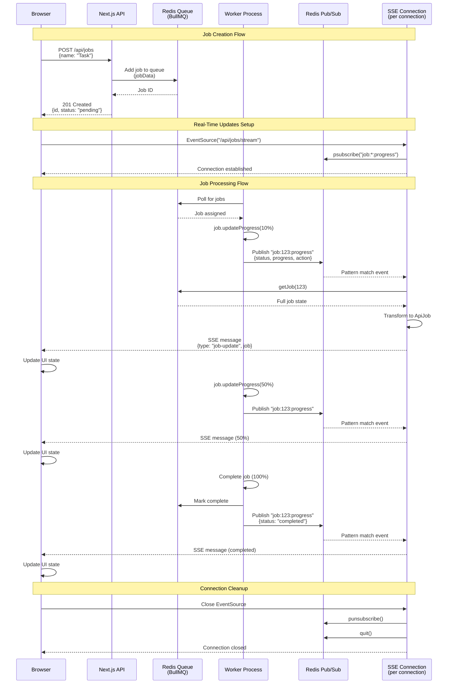
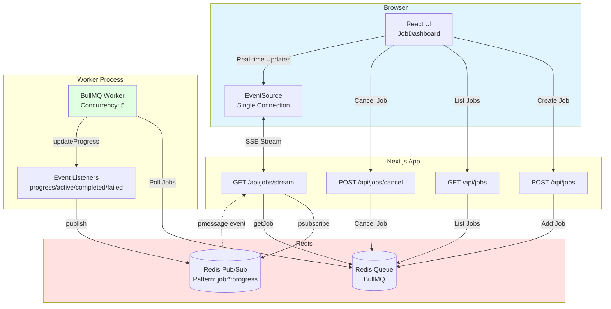

# Architecture Diagram

## Data Flow Architecture



## Component Architecture



## Key Architecture Decisions

### Single SSE Connection Pattern
- **Frontend**: Opens ONE EventSource connection to `/api/jobs/stream`
- **Solves**: Browser connection limit (6 per domain in HTTP/1.1)
- **Scales**: Can monitor 100+ concurrent jobs over single connection

### Per-Connection Redis Subscriber
- **Backend**: Each SSE connection creates own Redis subscriber
- **Pattern**: `psubscribe('job:*:progress')` receives ALL job updates
- **Cleanup**: Automatic on disconnect (no zombie connections)
- **Benefits**: No shared state, HMR-safe, multi-process safe

### Worker Event-Driven Publishing
- **Worker**: Uses BullMQ's `job.updateProgress()` (not direct Redis publish)
- **Events**: Worker listeners (`on('progress')`, `on('completed')`) publish to Redis
- **Single Source**: All pub/sub happens through worker event listeners
- **Consistency**: Guaranteed delivery through BullMQ event system

### Type-Safe Data Flow
```
JobData (create) → Queue → Worker → JobProgress (pub/sub) → ApiJob (SSE)
```
- **JobData**: Input shape `{id, name, createdAt}`
- **JobProgress**: Worker state `{status, progress, action, timestamp}`
- **ApiJob**: API response `{id, name, status, progress, logs, ...}`

## Data Flow Summary

1. **Create**: Browser → Next.js API → Redis Queue
2. **Process**: Worker polls queue → Processes job → Updates progress
3. **Publish**: Worker events → Redis Pub/Sub (`job:*:progress`)
4. **Stream**: Redis Pub/Sub → SSE subscriber → Browser EventSource
5. **Update**: Browser receives full job state → React re-renders UI

**Result**: Real-time job monitoring with clean separation of concerns
