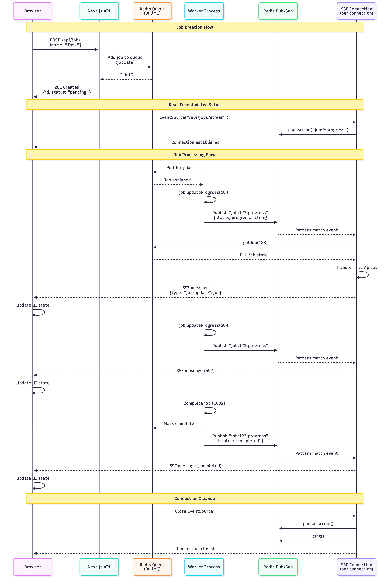
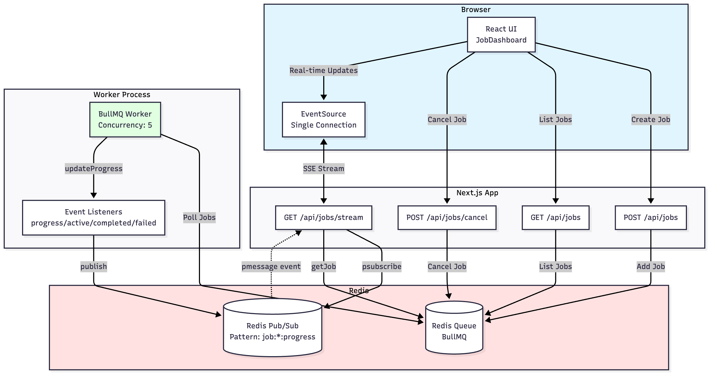

# NextJS Queue-Based Architecture Demo

Production-ready demonstration of asynchronous job processing using NextJS, Redis, BullMQ, and Server-Sent Events.

## Architecture

```
Browser → Next.js API → Redis Queue → Worker → Redis Pub/Sub → SSE → Real-time UI
```

- **Next.js 16**: API routes + React 19 UI
- **Redis + BullMQ**: Job queue & pub/sub
- **Worker**: Background job processor (max 5 concurrent)
- **SSE**: Real-time progress streaming (single connection pattern)

### Data Flow Sequence



### Component Architecture



📊 **[View Mermaid source diagrams](.claude/architecture-diagram.md)** (editable sequence & component flows)

## Quick Start

### Local Development

Run entire stack with hot reload:

```bash
docker compose up --build
```

Access at `http://localhost:3000`

**Stop:**
```bash
docker compose down
```

**Clean restart (wipes Redis data):**
```bash
docker compose down -v
docker compose up --build
```

### Production

```bash
docker compose -f docker-compose.prod.yml up --build
```

## Features

✅ Create, monitor, cancel, retry, delete jobs
✅ Real-time SSE progress updates
✅ Concurrent processing (5 jobs max)
✅ Mock web agent actions (10s duration)
✅ Manual retry only (no automatic retries)
✅ Admin dashboard for queue management
✅ Full TypeScript + tests (28 passing)

## API Endpoints

**Jobs API:**

- `POST /api/jobs` - Create job
- `GET /api/jobs` - List all jobs
- `GET /api/jobs/[id]` - Job details
- `DELETE /api/jobs/[id]` - Delete job
- `POST /api/jobs/[id]/cancel` - Cancel job
- `POST /api/jobs/[id]/retry` - Retry failed job (explicit only)
- `GET /api/jobs/stream` - SSE endpoint (single connection for all jobs)

**Admin API:**

- `GET /api/admin/queues` - Queue metrics
- `POST /api/admin/queues/clean` - Clean completed/failed jobs
- `POST /api/admin/queues/pause` - Pause queue
- `POST /api/admin/queues/resume` - Resume queue

## Project Structure

```
app/api/jobs/          # REST API routes
components/            # React components
lib/                   # Redis & queue utilities
worker/                # BullMQ worker (Docker)
test/                  # Unit tests (Vitest)
```

## Environment

`.env.local`:
```bash
REDIS_HOST=localhost
REDIS_PORT=6379
QUEUE_NAME=jobs
MAX_CONCURRENCY=5
```

## Testing

```bash
npm test              # Run tests
npm run test:watch    # Watch mode
```

28 tests covering API routes and queue operations.

## How It Works

1. **Job Created** → Added to Redis queue via BullMQ with `jobData` (id, name, createdAt)
2. **Worker Picks Up** → Processes for 10s with progress updates via `job.updateProgress()`
3. **Progress Published** → Worker event listeners → Redis pub/sub (`job:*:progress` pattern)
4. **SSE Streams** → Single frontend connection to `/api/jobs/stream` receives all job updates
5. **Per-Connection Subscriber** → Each SSE connection creates Redis subscriber, cleaned up on disconnect
6. **UI Updates** → React filters relevant jobs, updates state via EventSource
7. **Manual Retry** → Failed jobs require explicit retry via button/API (attempts: 1)

**Architecture Benefits:**

- Single SSE connection prevents browser connection limit (6 per domain)
- Per-connection Redis subscriber: simple, no shared state, automatic cleanup
- Works across dev HMR, multi-process deployments, and scaling scenarios

## Tech Stack

Next.js 16 • React 19 • TypeScript • Tailwind CSS 4 • shadcn/ui • Redis • BullMQ • Docker

## License

MIT
